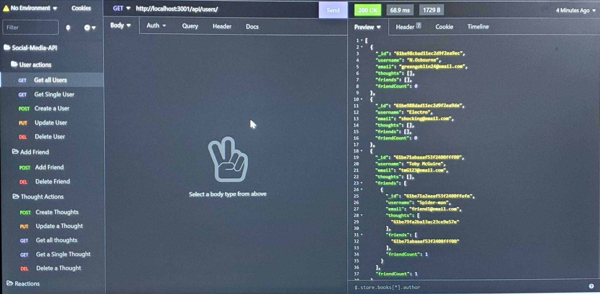

# Social Network API

## Licensing:

[](https://shields.io)


## Table of Contents

- [Description](#description)
- [Installation](#installation)
- [Usage](#usage)
- [Contribution](#contribution)
- [Testing](#testing)
- [Contact Info](#contact-info)

## Description:

This is an API project for a social network web application that utilizes MongoDB, Express.js, and Mongoose. Users can post their thoughts, react to friend's thoughts, and can add or remove friends from their personal list.
This is strictly a back-end project, so you will need to use Insomnia Core or Postman to access the routes.

## Installation:

This application uses node.js, express, MongoDB, Mongoose. To install necessary dependecies, run the following commands:
<br />
Clone the GitHub Repository
<br />

- npm install
- npm install express
- npm install mongoose
  <br />
  <br />
  Make sure you have Mongo DB installed. Open a terminal and start mongo by typing in "mongod" and that will start the server.
  <br />
  Run <strong>node server.js</strong> to create the server and be able to access in local host port.
  <br />Use either

[Insomnia](https://insomnia.rest/download)
or
[Postman](https://www.postman.com/) to access the routes.

The routes to use are as follows:

User Action Routes:

```
Get all users:
GET
http://localhost:3001/api/users/

Get a Single User:
GET
http://localhost:3001/api/users/:userId

Create a User:
POST
http://localhost:3001/api/users/

Update a User:
PUT
http://localhost:3001/api/users/:userId

Delete a User:
DELETE
http://localhost:3001/api/users/:userId

```

Thought Routes:

```
Get All Post:
GET
http://localhost:3001/api/thoughts/

Get a Single Post:
GET
http://localhost:3001/api/thoughts/userId

Create a new Thought:
POST
http://localhost:3001/api/thoughts/userId

Update a thought:
PUT
http://localhost:3001/api/thoughts/userId

Delete a Thought:
DELETE
http://localhost:3001/api/thoughts/userId
```

Friend Actions:

```
Add a Friend to a User's list:
POST
http://localhost:3001/api/users/:userId/friends/:friendId

Delete a Friend from your User list:
DELETE
http://localhost:3001/api/users/:userId/friends/:friendId

```

User Reactions:

```
Create a Reaction:
POST
http://localhost:3001/api/thoughts/:thoughtId/reactions

Delete a Reaction:
DELETE
http://localhost:3001/api/thoughts/:thoughtId/reactions

```

## Usage:

Use it as a test bed for a social media site's backend.

## License:

MIT

## Contribution:

Github Pull Request, Issue, or Reach out to a current contributor.

## Testing:

This product does not have a live demo for testing.

## Contact Info:

- Github: [Jeff Lester](https://github.com/JeffGoji)
- Email: jeff.lester01@outlook.com
